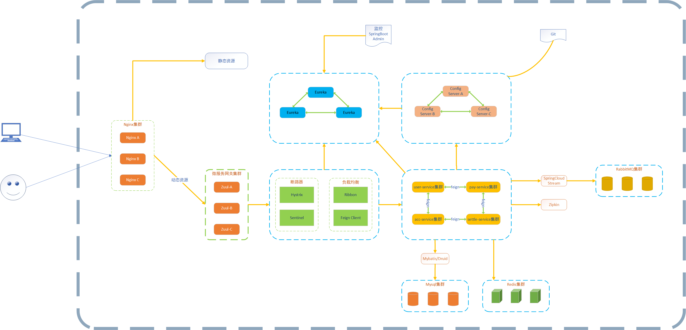

#Spring Cloud工具框架
  

Spring Cloud Config 配置中心，利用 Git 集中管理程序的配置。  
Spring Cloud Netflix 集成众多Netflix的开源软件。  
Spring Cloud Netflix Eureka 服务中心（类似于管家的概念，需要什么直接从这里取，就可以了），一个基于 REST 的服务，用于定位服务，以实现云端中间层服务发现和故障转移。  
Spring Cloud Netflix Hystrix 熔断器，容错管理工具，旨在通过熔断机制控制服务和第三方库的节点，从而对延迟和故障提供更强大的容错能力。  
Spring Cloud Netflix Zuul 网关，是在云平台上提供动态路由，监控，弹性，安全等边缘服务的框架。Web 网站后端所有请求的前门。  
Spring Cloud Netflix Archaius 配置管理 API，包含一系列配置管理API，提供动态类型化属性、线程安全配置操作、轮询框架、回调机制等功能。  
Spring Cloud Netflix Ribbon 负载均衡。  
Spring Cloud Netflix Fegin REST客户端。  
Spring Cloud Bus 消息总线，利用分布式消息将服务和服务实例连接在一起，用于在一个集群中传播状态的变化。  
Spring Cloud for Cloud Foundry 利用 Pivotal Cloudfoundry 集成你的应用程序。  
Spring Cloud Cloud Foundry Service Broker 为建立管理云托管服务的服务代理提供了一个起点。  
Spring Cloud Cluster 集群工具，基于 Zookeeper, Redis, Hazelcast, Consul 实现的领导选举和平民状态模式的抽象和实现。  
Spring Cloud Consul 基于 Hashicorp Consul 实现的服务发现和配置管理。  
Spring Cloud Security 安全控制，在 Zuul 代理中为 OAuth2 REST 客户端和认证头转发提供负载均衡。  
Spring Cloud Sleuth 分布式链路监控，SpringCloud 应用的分布式追踪系统，和 Zipkin，HTrace，ELK 兼容。  
Spring Cloud Data Flow 一个云本地程序和操作模型，组成数据微服务在一个结构化的平台上。  
Spring Cloud Stream 消息组件，基于 Redis，Rabbit，Kafka 实现的消息微服务，简单声明模型用以在 Spring Cloud 应用中收发消息。  
Spring Cloud Stream App Starters 基于 Spring Boot 为外部系统提供 Spring 的集成。  
Spring Cloud Task 短生命周期的微服务，为 Spring Booot 应用简单声明添加功能和非功能特性。  
Spring Cloud Task App Starters。  
Spring Cloud Zookeeper 服务发现和配置管理基于 Apache Zookeeper。  
Spring Cloud for Amazon Web Services 快速和亚马逊网络服务集成。  
Spring Cloud Connectors 便于PaaS应用在各种平台上连接到后端像数据库和消息经纪服务。  
Spring Cloud Starters （项目已经终止并且在 Angel.SR2 后的版本和其他项目合并）  
Spring Cloud CLI 命令行工具，插件用 Groovy 快速的创建 Spring Cloud 组件应用。  

#本项目架构图(spring-cloud-x)

#本项目文档说明：  
[Spring Cloud 之 架构前言&附图（一）](https://www.cnblogs.com/shileibrave/p/14430823.html)  
[Spring Cloud 之 Eureka 高可用集群搭建（二）](https://www.cnblogs.com/shileibrave/p/14429339.html)  
[Spring Cloud 之 Eureka Client服务注册（三）](https://www.cnblogs.com/shileibrave/p/14430638.html)  
[Spring Cloud 之 Lombok集成（四）](https://www.cnblogs.com/shileibrave/p/14431465.html)  
[Spring Cloud 之 Ribbon服务消费（五）](https://www.cnblogs.com/shileibrave/p/14435273.html)  
[Spring Cloud 之 Feign Client服务消费（六）](https://www.cnblogs.com/shileibrave/p/14435678.html)  
[Spring Cloud 之 Feign Client优雅调用（七）](https://www.cnblogs.com/shileibrave/p/14436460.html)  
[Spring Cloud 之 Knife4j集成（八）](https://www.cnblogs.com/shileibrave/p/14437592.html)  
[Spring Cloud 之 Ribbon集成Hystrix基本使用（九）](https://www.cnblogs.com/shileibrave/p/14439670.html)  
[Spring Cloud 之 Feign集成Hystrix基本使用（十）](https://www.cnblogs.com/shileibrave/p/14440241.html)  
[Spring Cloud 之 Hystrix Dashboard监控搭建（十一）](https://www.cnblogs.com/shileibrave/p/14451172.html)  
[Spring Cloud 之 Hystrix Turbine监控搭建（十二）](https://www.cnblogs.com/shileibrave/p/14451383.html)  
[Spring Cloud 之 SpringBoot Admin监控搭建（十三）](https://www.cnblogs.com/shileibrave/p/14452093.html)  
[Spring Cloud 之 Zuul网关搭建（十四）](https://www.cnblogs.com/shileibrave/p/14452604.html)  
[Spring Cloud 之 Zuul网关Filter过滤器应用（十五）](https://www.cnblogs.com/shileibrave/p/14453054.html)  
[Spring Cloud 之 链路追踪Sleuth和Zipkin整合（十六）](https://www.cnblogs.com/shileibrave/p/14462663.html)  
[Spring Cloud 之 链路追踪Sleuth和Zipkin，RabbitMQ整合（十七）](https://www.cnblogs.com/shileibrave/p/14464323.html)  

